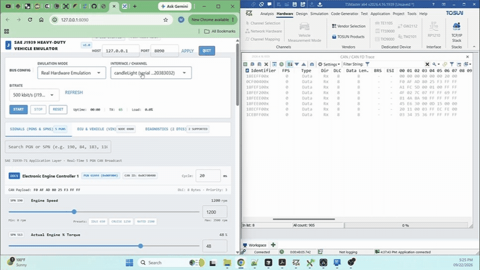
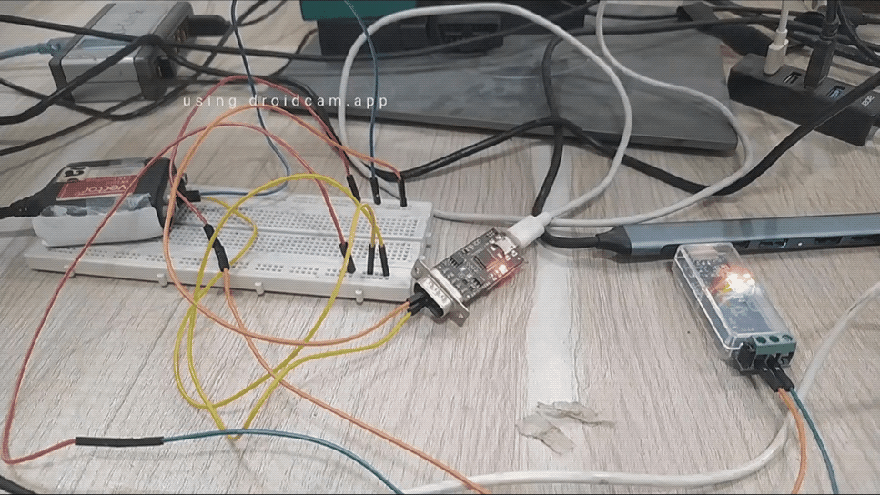
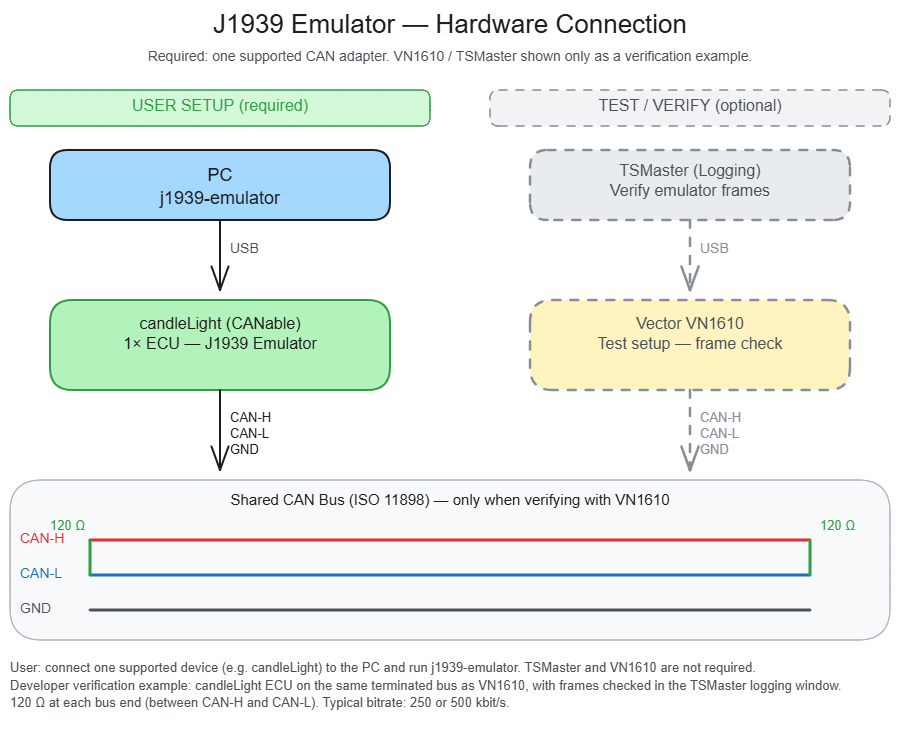

# j1939-emulator

SAE J1939 heavy-duty vehicle ECU emulator for fleet and telematics QA.
Simulate engine signals, address claim, VIN, and diagnostic faults on a **virtual** or **physical** CAN bus—no truck required.

Built with **python-can**, **can-j1939**, and **NiceGUI**.

**Requirements:** Python **3.11+** · Windows, Linux, or macOS · a browser for the GUI (Chrome, Edge, or Safari)

### What you get (v1.0)

| Area | Capability |
|------|------------|
| **Bus** | Real hardware detect or Virtual (`vcan0` / `vcan1` / `vcan2`) · START / STOP / RESET · live TX stats |
| **Signals** | 5 cyclic PGNs with live SPN controls, payload hex, search, per-PGN `cycle_ms` |
| **ECU / VIN** | Single node SA `0x00` · J1939-81 address claim · VIN on PGN 65260 (VI) |
| **Diagnostics** | 2 injectable DTCs on DM1 (PGN 65226): SPN 110/FMI 3, SPN 190/FMI 0 |
| **UI** | CLI or NiceGUI (default `http://127.0.0.1:8080`) |

---

## Demo

GUI live on a real CAN adapter (software view):



Hardware on the bench while the emulator runs:



**Full video walkthrough** (install + run): [Watch on YouTube](https://www.youtube.com/watch?v=x52c0_clW10)

---

## Hardware Setup

One supported CAN adapter is enough to run the emulator. The Vector VN1610 + TSMaster path is optional — used only to verify frames on a shared bus.



**Tested on:** CANable / candleLight (slcan / candle), Vector VN1610

---

## 1. Clone and set up

Run every command from the **repository root** (`j1939-emulator`), not from the inner `j1939_emulator` package folder. That root is where `pyproject.toml` and `examples/` live.

Pick **one** shell and follow its block end-to-end.

### Windows PowerShell

```powershell
git clone https://github.com/EmbeddedVerse/j1939-emulator.git
cd j1939-emulator

python -m venv .venv
.\.venv\Scripts\Activate.ps1
```

If activation fails with `running scripts is disabled`:

```powershell
Set-ExecutionPolicy -Scope CurrentUser RemoteSigned
.\.venv\Scripts\Activate.ps1
```

Or skip Activate and call the venv Python by full path in later steps, e.g. `.\.venv\Scripts\python.exe -m pip install …`.

### Windows Command Prompt (cmd.exe)

```bat
git clone https://github.com/EmbeddedVerse/j1939-emulator.git
cd j1939-emulator

python -m venv .venv
.venv\Scripts\activate.bat
```

### Linux / macOS

```bash
git clone https://github.com/EmbeddedVerse/j1939-emulator.git
cd j1939-emulator

python3 -m venv .venv
source .venv/bin/activate
```

---

## 2. Install

Stay in the repository root with the venv **activated** (your prompt should show `(.venv)`).

### Quick start (Virtual bus — enough to try CLI + GUI)

**Windows PowerShell**

```powershell
python -m pip install --upgrade pip
python -m pip install -e .
```

**Windows Command Prompt**

```bat
python -m pip install --upgrade pip
python -m pip install -e .
```

**Linux / macOS**

```bash
python -m pip install --upgrade pip
python -m pip install -e .
```

This installs the app plus **can-j1939**, **nicegui**, **cantools**, **libusb-package**, and a base **python-can** set. On **Windows**, **pywin32** is also installed (required by can-j1939). You can run Virtual Emulation immediately—no CAN adapter required.

### Full install (Real Hardware adapters)

Use this if you will connect Peak, Vector, candleLight, etc. Vendor **OS drivers** are still required for those devices.

**Windows PowerShell**

```powershell
python -m pip install --upgrade pip
python -m pip install -e . "python-can[gs-usb,serial,candle,pcan,neovi,canalystii,nixnet,seeedstudio,cvector,remote,sontheim,canine,zlgcan,viewer,mf4,multicast,pywin32]"
```

**Windows Command Prompt**

```bat
python -m pip install --upgrade pip && python -m pip install -e . "python-can[gs-usb,serial,candle,pcan,neovi,canalystii,nixnet,seeedstudio,cvector,remote,sontheim,canine,zlgcan,viewer,mf4,multicast,pywin32]"
```

**Linux / macOS**

```bash
python -m pip install --upgrade pip && python -m pip install -e . "python-can[gs-usb,serial,candle,pcan,neovi,canalystii,nixnet,seeedstudio,cvector,remote,sontheim,canine,zlgcan,viewer,mf4,multicast]"
```

Optional CANtact (needs [Rust](https://rustup.rs)):

```bash
python -m pip install "python-can[cantact]"
```

---

## 3. Run — CLI

With the venv activated and still at the **repository root**:

```bash
python -m j1939_emulator --config examples/ecu.toml
```

Uses Virtual channel `vcan0` at 500 kbit/s by default (see `examples/ecu.toml`). On START the ECU claims SA `0x00` and broadcasts VIN.

### Discover channels (Virtual or Real)

List adapters, then pass the **number** to `--channel`:

```bash
python -m j1939_emulator --list-channels --mode virtual
python -m j1939_emulator --list-channels --mode real
```

Example (Real hardware — pick channel **1** from the list):

```bash
python -m j1939_emulator --list-channels --mode real
python -m j1939_emulator --config examples/ecu.toml --mode real --channel 1 --bitrate 500000
```

#### From scratch — Real Hardware (Windows PowerShell)

```powershell
git clone https://github.com/EmbeddedVerse/j1939-emulator.git
cd j1939-emulator

python -m venv .venv
.\.venv\Scripts\Activate.ps1

python -m pip install --upgrade pip
python -m pip install -e . "python-can[gs-usb,serial,candle,pcan,neovi,canalystii,nixnet,seeedstudio,cvector,remote,sontheim,canine,zlgcan,viewer,mf4,multicast,pywin32]"

python -m j1939_emulator --list-channels --mode real
python -m j1939_emulator --config examples/ecu.toml --mode real --channel 1 --bitrate 500000
```

#### From scratch — Real Hardware (Windows Command Prompt)

```bat
git clone https://github.com/EmbeddedVerse/j1939-emulator.git
cd j1939-emulator

python -m venv .venv
.venv\Scripts\activate.bat

python -m pip install --upgrade pip
python -m pip install -e . "python-can[gs-usb,serial,candle,pcan,neovi,canalystii,nixnet,seeedstudio,cvector,remote,sontheim,canine,zlgcan,viewer,mf4,multicast,pywin32]"

python -m j1939_emulator --list-channels --mode real
python -m j1939_emulator --config examples/ecu.toml --mode real --channel 1 --bitrate 500000
```

On your PC that might look like:

```text
Available Real CAN channels (4):

  #   Adapter
  --  -----------------------------------------------
  1   candleLight  (serial ...20313730)
  2   candleLight  (serial ...20383032)
  3   Vector VN1610 Channel 1
  4   Vector VN1610 Channel 2

Put the number after --channel. Example:
  python -m j1939_emulator --config examples/ecu.toml --mode real --channel 1 --bitrate 500000
```

So `--channel 1` means the first candleLight; `--channel 3` means VN1610 Channel 1. For Virtual mode you can also use names `vcan0`, `vcan1`, `vcan2`.

### Other launch examples

```bash
python -m j1939_emulator --config examples/ecu.toml --mode virtual --channel vcan0 --bitrate 500000
python -m j1939_emulator --config examples/ecu.toml --mode virtual --channel vcan1 --bitrate 250000
python -m j1939_emulator --config examples/ecu.toml --no-start
```

### At the `>` prompt

```text
channels
channels real
channel
channel 1
mode
mode virtual
bitrate
bitrate 500000
info
status
payloads
get eec1.spn190_rpm
set eec1.spn190_rpm 2100
set ccvs.spn84_speed_mph 65
vin
vin 1HTMMAAL7GH123456
dtc 1 on
dtc 2 off
dtc both on
dtc both off
stop
start
reset
help
quit
```

| Command | Meaning |
|---------|---------|
| `channels [real\|virtual]` | List adapters; note the **#** to use with `--channel` / `channel` |
| `channel [N]` | Show current channel or select by number (e.g. `channel 1`) |
| `mode [real\|virtual]` | Show or change emulation mode |
| `bitrate [Hz]` | Show or set bitrate (`125000`…`1000000`) |
| `info` | Dump runtime config (`key=value`, handy for scripts/cloud) |
| `get <key>` / `set <key> <value>` | Read / change an SPN |
| `vin [value]` | Show or set VIN (rebroadcasts PGN 65260 if running) |
| `dtc 1\|2\|both on\|off` | Inject / clear DM1 faults |
| `status` / `payloads` | Live stats / PGN hex |
| `stop` / `start` / `reset` / `quit` | Session control |

`info` and `channels` are intended for automation (Docker/CI/fleet mock hosts): discover adapters, then pin `--mode` / `--channel 1` / `--bitrate` in the process command or TOML.

---

## 4. Run — GUI (localhost)

```bash
python -m j1939_emulator --gui
```

The default browser opens automatically at `http://127.0.0.1:8080`.

Custom host/port:

```bash
python -m j1939_emulator --gui --host 127.0.0.1 --port 8090
```

Use `--no-browser` to skip auto-open. In the top bar you can change **Host** / **Port** and click **Apply** (restarts the UI), or click **QUIT** to stop the server and return to the shell.

Optional preset from TOML:

```bash
python -m j1939_emulator --gui --config examples/ecu.toml
```

Typical workflow:

1. Choose **Virtual Emulation** (no hardware) or **Real Hardware** (adapters attached)
2. Select channel and bitrate (**250 kbit/s** traditional/common, **500 kbit/s** J1939/modern)
3. Click **START** — address claim + VIN broadcast begin with cyclic PGNs
4. **Signals** tab — adjust SPNs live; search; edit `cycle_ms`
5. **ECU & Vehicle (VIN)** tab — edit VIN, Copy, view NAME / SA (claim chip when online)
6. **Diagnostics** tab — Inject / Clear the two DTCs (DM1 while running)
7. Click **QUIT** when finished

### Bus modes

| Mode | Channels | Hardware |
|------|----------|----------|
| **Virtual Emulation** | `vcan0`, `vcan1`, `vcan2` (python-can software bus) | Not required |
| **Real Hardware** | Detected adapters (e.g. candleLight, Vector VN1610, …) | Adapter must be connected; unplugged devices do not appear |

### Tips

- If port **8080** is already in use: `python -m j1939_emulator --gui --port 8090`
- Always stop the app with **QUIT** (or Ctrl+C in the terminal) so the server process exits
- Virtual mode needs no CAN hardware and is the fastest way to verify the install

---

## 5. Example config

See [`examples/ecu.toml`](examples/ecu.toml). Key fields:

```toml
[bus]
mode = "virtual"          # "real" | "virtual"
channel = "vcan0"
bitrate = 500000          # 125000 | 250000 | 500000 | 1000000
start_on_launch = true

[ecu]
source_address = 0x00
industry_group = 0
vehicle_system = 0
name = 0x0020000000000000

[vehicle]
vin = "1HTMMAAL7GH123456"

[diagnostics]
dtc_spn110_fmi3 = false   # SPN 110 / FMI 3 — amber warning
dtc_spn190_fmi0 = false   # SPN 190 / FMI 0 — red stop

# Optional [pgn.eec1], [pgn.ccvs], [pgn.fuel], [pgn.et1], [pgn.vd]
# with enabled, cycle_ms, and SPN defaults — see examples/ecu.toml
```

---

## License

MIT — see [LICENSE](LICENSE).
